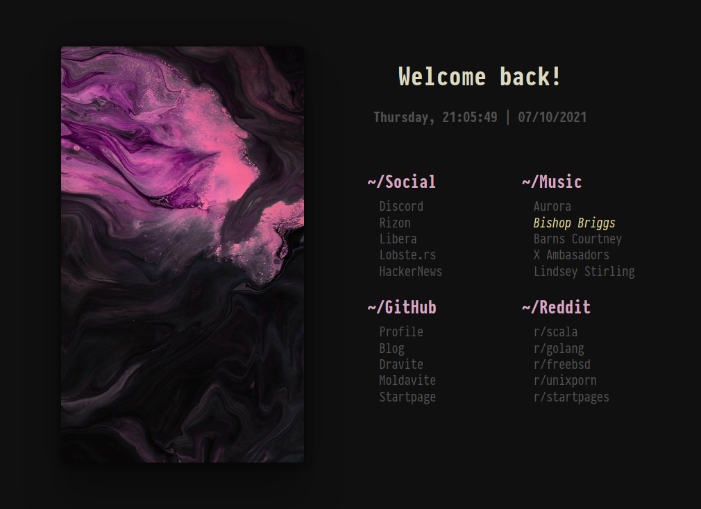

# startpage
<h1 align="center">THIS REPO IS ARCHIVED AND NO LONGER RECIEVING UPDATES. PLEASE HEAD TO THE NEW GITLAB PAGE</h1>

[startpage gitlab](https://gitlab.com/fazzi/startpage "page")

Yet another minimal startpage:
- Font: Iosevka
- Theme: Catppuccin

> **NOTE**: keep it in mind that I don't own any rights to image included in this repo.

## Configuration
Simply edit `scss/theme.scss` and setup favourite font and colors!

### Preview:

